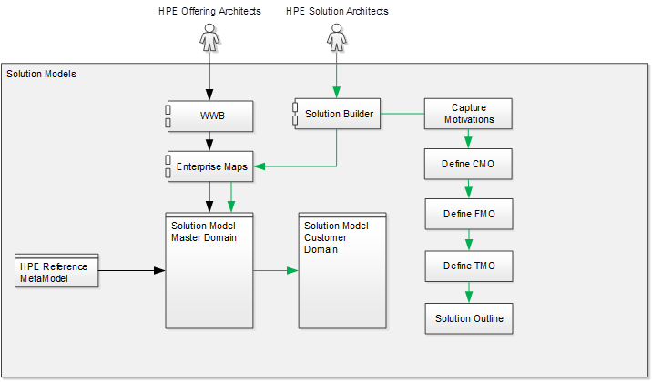
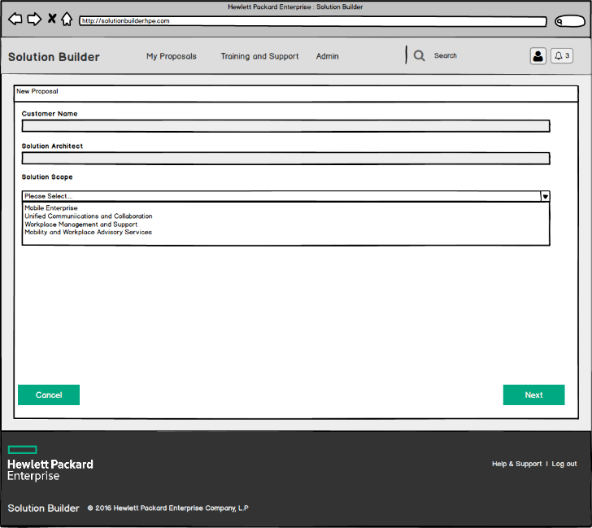
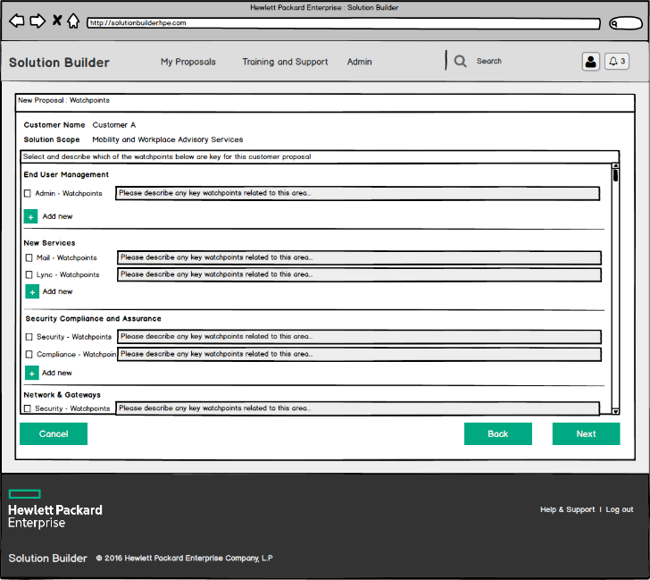
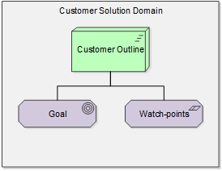
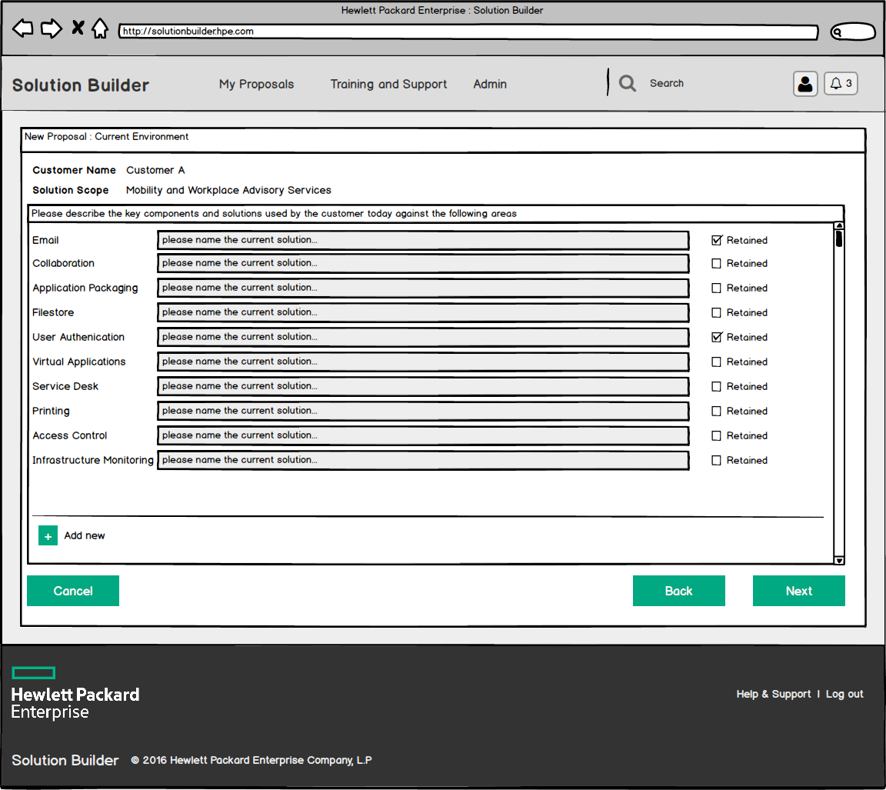
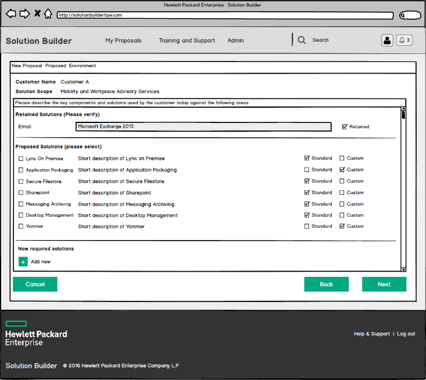
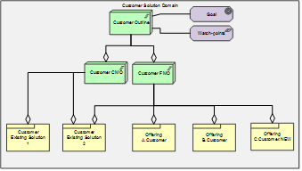
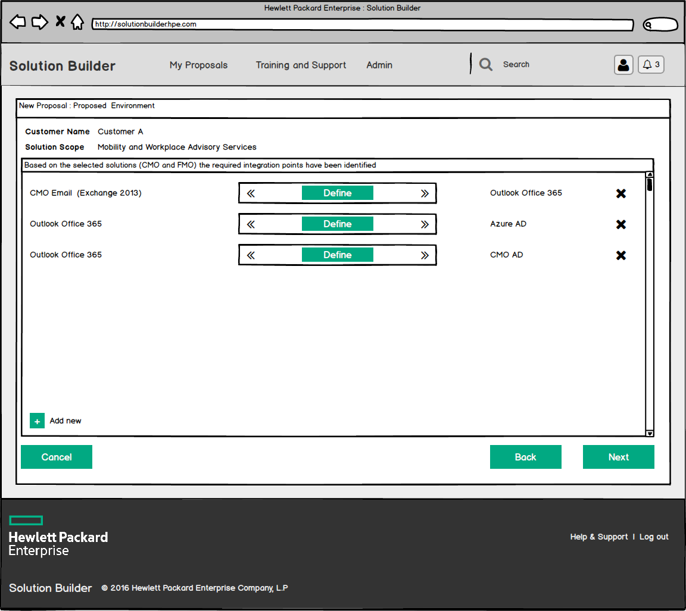
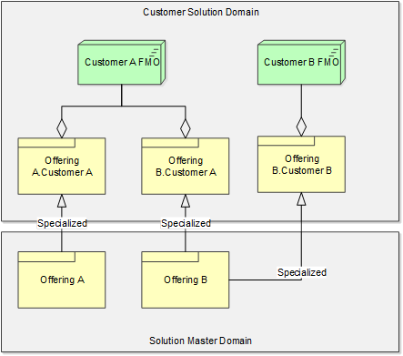
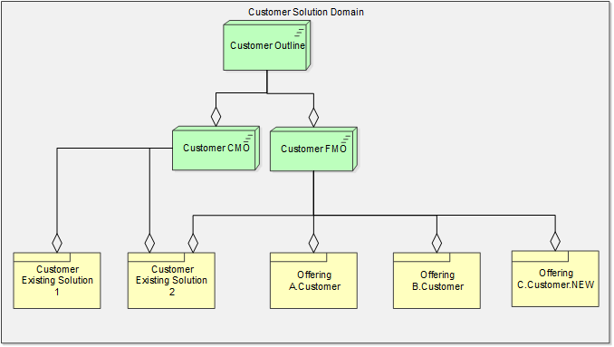

# Composition

Feb 2016

David Stevens

## Abstract

The ability to develop validated solution outlines, would allow any service integrator to present lower risk proposals to its customers.  An outline which not only defines the proposed solution, but also calls out the impact to the existing environment, as well as ensuring the underlying business motivations of the customer are captured, known and adhered to, all build out against a set defined use cases for a given business scenario.  Leveraging HPE intellectual property and experience and adopting open industry standards this paper outlines an approach where a solution proposal can be developed which generates a usable solution outline and associated model, with traceability and relationships across the requirements, the current environment and the proposed solution.

## Problem Solved

Developing proposals today is a paper based exercise, with individual offering leads or towers working on their part of the overall solution, the information compiled is difficult to collate and form a clear end 2 end view of the proposed solution.  Often areas are missed and in some cases components are duplicated across the proposal.   The output cannot be used to validate the integrity of the solution or use downstream to enrich or automate the implementation activities.

## Prior Solutions

As stated within the statement above, the current solutions take a paper or spreadsheet approach to document and develop the solution and the solution architecture is often no more than a diagram within a presentation.   Configuration Management Systems can provide some insight into the current mode of operation, however the dataset maintained within a CMS does not provide information related to the required or available integrations and how these might impact a transformation or upgrade program.   Understanding the key activities required for a transformation program is critical for the success of HPE and its customers.

## Description

Our approach builds upon the usage of a standard reference model to describe both current IT solutions and the proposed solutions; the reference model adopted describes each solution module in detail, calling out key elements of how the solution integrates, how and by whom the solution is supported, functional and non-functional capabilities associated with the solution; plus, business motivational elements such as watch-points and requirements.

The underlying meta-model is based on the “ES Solution Reference Model” [1] [2] with a model based repository providing the backend solution.  Figure 1 below illustrates the functional view of the overall repository, with the solution builder leveraging content provided by the offering architects.  Note, the development of the solution outline model requires the potential solution components to be described within the repository by their respected solution architects, this is outside the scope of this paper, however these offering solution patterns are used by the Proposal Solution Architect to develop a solution outline for a customer within a form based wizard called the “Solution Builder”

 

Figure 1: Functional View of the overall Solution Modelling platform

Framed against a set of reference use cases for a potential engagement (figure 2), the Proposal Solution Architect starts by confirming known motivations and watch-points with the customer (figure 3); these watch-points are used within the transformation outline to ensure these are known and can be addressed.  At this stage, the related solution outline model starts to be built.  With the top level viewpoints created for the customer as shown in figure 4 below.

 
 
 

The next step for the Proposal Solution Architect, is to capture the capabilities within the current environment or Current Mode of Operation (CMO); again framed against the scope of the project, these capabilities are captured against generic objects and the Proposal Solution Architect can detail which of these existing capabilities will be retained in to the proposed solution (figure 5).  This in turn extends the solution outline model as shown in figure 6.

 
 

The Proposal Solution Architect then proceeds to define the proposed solution or Future Mode of Operation (FMO), at this point the available solutions are retrieve from both those solutions identified as being retained in the current environment and also solutions which are available from the central repository, filtered based on the scope of the project as shown in figure 7 below.

This stage of the process also allows the Proposal Solution Architect to add any new solution components required to the proposal.  At this point the new components are captured as simple class objects and do not require the full information model to be defined.   The first combined current mode and proposed solution models are now nearing completion as illustrated within figure 8.

 
 

With the current environment and proposed solution outlined, the Proposal Solution Architect is presented with a summary of the proposed solution and is able to move to the final step of the builder application, where known integration points between current and new solutions (and new to new) can be confirmed and documented if known (figure 9).

 

As the solution outline model is developed, clear viewpoints for the customer are defined against both the current and proposed solution.  These viewpoints and the model are available for further detailed inspection and development as the proposal progressives.  One key point is the selected solution components in the proposal are specialized from their master instances and a “reuse” relationship is maintained, giving clear insight for the solution owner as to where their components are proposed.

### Model hooks in detail

#### Plateaued viewpoints

The overall solution is grouped at 3 key points, the overall solution outline is the top level, with secondary viewpoints created to capture the related classes for both the current mode of operation and the proposed solution (Future Mode of Operation(FMO)), the Archimate plateau class is used for these 3 viewpoins, with each underlying solution related to the plateau via the “aggregation” relationship concept as illustrate in figure 10 below

 

#### Specialized Solutions
Each solution leveraged from the central repository of approved solutions within the proposed viewpoint is a copy of the master object, the reuse of each master solution object is maintained via the “specialized” relationship between the master object and all customer proposal instances, as shown in figure 11 below.

 

This allows the solution owner of the master object to track all occurrences of their solutions across all proposed solutions.

Version control of offerings
Similar to the plateaued views of the solution, a plateau is created against each master offering to provide a viewpoint of the configuration of the offering at any given point in time.   This extends through to the solution proposal with a maintained trace of the offering version included within each proposal.

### Solution Class Security Model
There is a requirement to ensure only solution owners can update and add to the solution master domain and that Proposal Solution Architects can only retrieve information from this domain into their solution proposal.  As the Proposal Solution Architect develops their proposal they would require full access to the customer solution domain as illustrated in figure x below.

### Advantages
The platform provides both an interactive method to understand and develop the proposed solution thus reducing risk, but also increased level of automation with a paperless proposal made available to a customer.  Depending on the depth of the solution component model there is also the potential for automated deployments.

### Standards
The outlined approach within this paper is aligned to the OpenGroup Archimate 2.1 specification and standard.