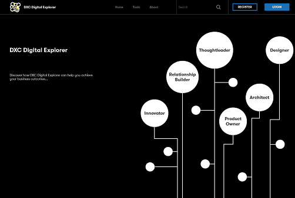
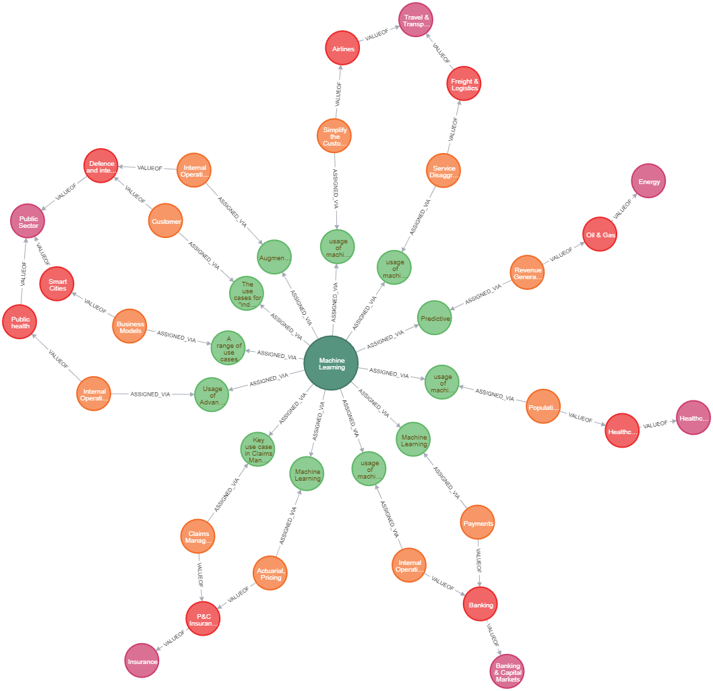
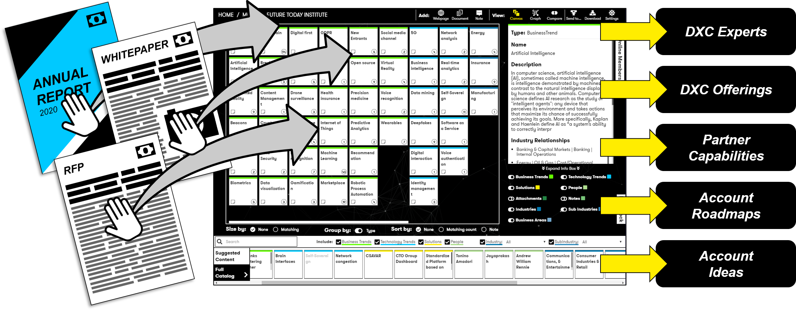
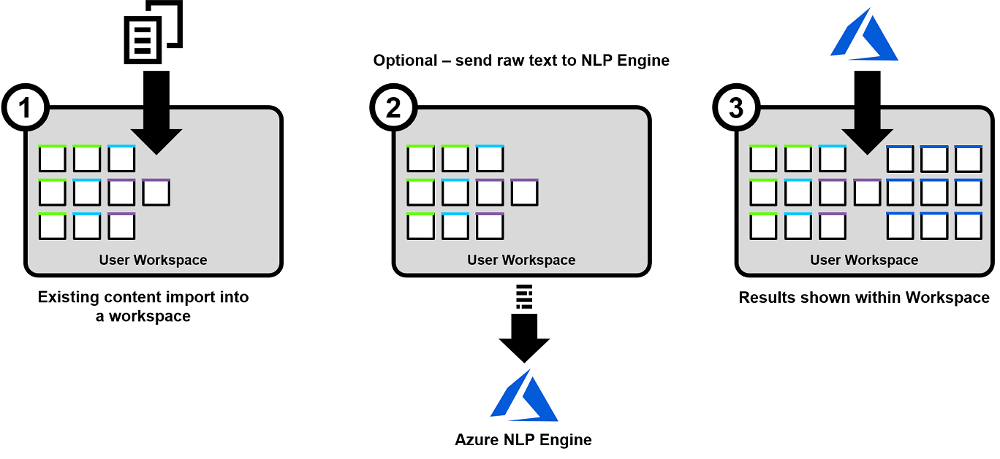
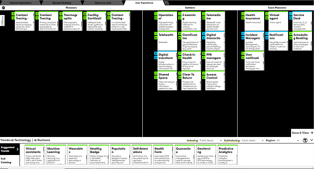
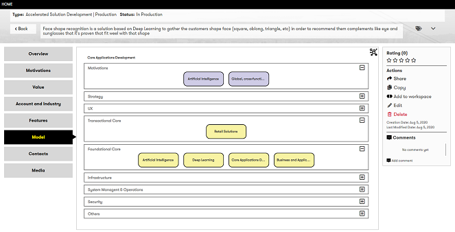
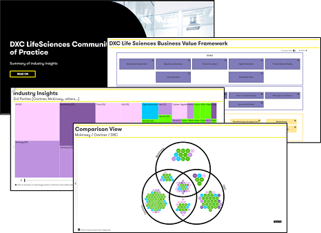
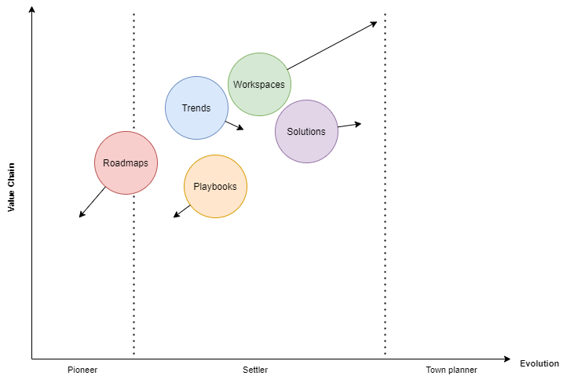

# Digital Explorer
## David versus Goliath

[DXC Digital Explorer](https://digitalexplorer.dxc.com) is a pioneering project within the DXC Global Technology Office, sponsored by the Global CTO and Chief Architect.   The platform enables a fully data driven customer engagement from understanding requirements to composing solutions.   Leveraging a Neo4j Graph database platform, the platform provides 5 highly connected modules.    

 

### Where do I see the adoption and value of these modules today?

## Trends

Trends is both a research(for reading) and contribution module; whereby individuals and teams review the relevant trends for a given business area; framed against the DXC industry business value framework the module provides a familiar navigation channel for both new and regular users.  The power of the Graph comes into play as we connect multiple use cases against a single trend entry; allowing teams to develop rich viewpoints of a single trend and it's wide ranging impact across multiple industries.

 
_Example of a highly connected trend_

### Trend usage patterns
The harsh reality is that the level of contribution is not where it needs to be, it's a group of core contributors who keep the trend information up to date (*heroes don't scale*); despite the module being the most viewed of all 5 modules the ratio of readers to contributors is currently at **52:1**

#### Rolling the dice
The module is ideally suited for the DXC industry communities and go to market teams; providing a single location to capture their market trend viewpoints and compare against other sources; the challenge still remains individual industry teams working in silos and creating static content within their own PowerPoint decks.   

#### Alternatives outside of Digital Explorer
Can a well managed, structure approach to MS Teams and the content created within them break the barriers of deferring back to industry silos and individual viewpoints?    It was this original issue and lack of awareness of pan-industry opportunities which triggered the creation of the trends module in the first place.

### Recommendation : Gain formal adaption within DXC ACE or **Archive**
Can the DXC industry teams adopt this module and it's potential value of connected insights?  or do we roll the dice and look at a fully automated machine derived answer?

With the updates in development within the Workgroup module, there is certainly the possibility to archive this module and switch to a 100% machine learning approach to highlighting the key trends from the external content analyse with the NLP update in development; the PageRank algorithm would certainly be able to return the highest value themes\trends across all the workgroups created; paired with knowledge of an associated customer or industry automated filters can be applied to present a similar viewpoint to that manually curated today.

## Workgroups

Workgroups is the central working module of the platform; it's where [relationship builders, innovators and architects](../Personas/readme.md) can combine efforts to analyse requirements, capture the hypothesis and progress these into high level architecture models.

 

### Workgroup usage patterns
The key and primary usage pattern for the workgroups modules are the individual workspaces a team creates; providing an intelligent online collaboration canvas to model and understand requirements.   Since the introduction of the intelligent document reader the usage of workgroups has accelerated; from single digit numbers of workspaces to now close to 2,000 individual workspaces having been created (+15 a week).  However the daily usage numbers are low and the general awareness of the platform within the organisation continues to impact the potential usage rates.

#### Rolling the dice
A more advanced version of the intelligent document reader is in development, which will provide [full natural language (NLP)](../NLPinGraph/readme.md) analyse of the provided content, no longer just matching against "what we already know", it will provide far deeper insights into all the key themes within each document; I believe this will extend further the business value of this module and reveal more interesting use cases.    **We must promote and drive increased awareness of this update across the full organisation; targeted emails, information blasts on DXC workplace, invites to team meetings, a follow-up SME session.**

 

#### Alternatives outside of Digital Explorer
There are many online, visual collaboration tools (stormboard, Mural, Miro to name but 3), the major difference and value Workgroups brings both DXC and it's open source users is the intelligent document readers and the ability to highlight key themes and potential trends across a collection of workgroups. Some minor improvements how workgroups are categorized has the potential to provide an centralized research and competitive analyse workbench and give insights to individual workgroup users (e.g. this theme occurs in *x* other workgroups).   I do not see any commercial or open source product providing that level of connection today.  Whilst teams continue to use these other platforms, the pending paywall and lack of an enterprise agreement to export and use the outcomes within these alternatives shouldn't be under estimated.

### Recommendation : **Extract and Invest**
Extract the module to it's own standalone application, rebrand ("DXC Spaces") and provide a fully open sourced (simplified) offering promoted through GTM channels.

- De-couple the solutions and recommendation engine, enabling this internally if the solutions module with reference solutions and portfolio offerings can truly secure a trusted data feed and the levels of contribution required to make these recommendations of value.

---

## Roadmaps

The roadmap module provides the ability to create customer roadmaps (does what is says on the tin), aligned to the DXC innovation flightplan, Transformation Maps(T-Map), risk tables and any resulting ideas\hypothesis worth discussing with a customer can be captured.    It leverages the power of the Graph at various points, from recommending similar trends from other users roadmaps to analysing and matching similar customer ideas.  

 

### Roadmaps usage patterns
The adoption of the roadmaps module is critically low, in part impacted by the presentation of one of the key artefacts (the T-Map diagram), updates have been made to the platform to improve the presentation and sharing of the roadmap information and the original intent of the *playbooks* module was to give accounts a more engaging method to present and share their roadmaps with customers; I think the messaging and training on this update was an opportunity missed.  But there is also a change management and communication issue  impacting the adoption and longer term improvement of this module, innovation leaders (regional, industry and practice) continue to except the artefacts created in silos as Microsoft office based documents, ignoring and losing the ability to scan, collate and act on similar hypothesis across single or multiple industry sectors.

2020 viewpoint : Currently there are 281 roadmaps created within the platform, an increase of 76 for the year to date; this increase was mainly during the Q1 (early lockdown) period.

#### Alternatives outside of Digital Explorer
Can the promise of [MS Cortex](https://resources.techcommunity.microsoft.com/project-cortex-microsoft-365/) and a well structured/connected approach to the creation and maintenance of MS Teams sites resolve the issues to connect and develop those small and common business opportunities. 

### Recommendation : **Archive**

## Solutions

The one which started it all, a model based approach to solution architecture; *what we build*, *solution explorer*, *digital explorer : solutions*, it's had quite a journey and many contributors (and distractors) along the way.    The vision of the solutions module is to allow users to create, share and reuse other solution models to compose their own new solutions.  Models which can include patterns and varying viewpoints from a single data model.    The underlying model is based on the [Opengroup Archimate](https://www.opengroup.org/archimate-forum/archimate-overview) standards and has been a key influencer of the [DXC Technical Doctrine](https://www.dxc.technology/innovation/insights/147802-dxc_s_technical_doctrine)'s solution blueprint and standards guidelines.

### Solution usage patterns
The solution module has proven an excellent platform to support the annual [Technical Excellence](https://www.dxc.technology/innovation/flxwd/146374-2019_awards_for_technical_excellence) rewards program, ensuring solutions are submitted and take advantage of the developing technical doctrine standards; we have also developed supporting "people vote" updates to support the program.   The challenge is how to address the potential deadend of creating content within the platform itself; Digital Explorer Solutions must provide a means for users to export and continue working on their solution models outside of the platform.   A working information exchange between files & folders (MS teams), GitHub and other CMS platforms needs to be found.   

In terms of a feeder of the recommendation engine for the Workgroups module, one continuous struggle is a secured data feed from our own portfolio team; impacted by rehosting a key data repository, the urgency and executive drive isn't there to push this to a new resolution; despite continued minor mentions about the value of doing so, the final push or message is always missing.

 

### Rolling the dice

Is the solutions module a centralized repository of completed solutions or a modelling/creation tool?

The big bet with the Solution module is [*composition*](../Composer/readme.md), the final piece of the puzzle to complete the original vision and intent of the module.    Is composition this modules "intelligent document reader" and the accelerator for adoption?  Once the executive leaders see composition in practice their drive to feed in their own portfolio information will follow?

As a centralized repository of completed solutions, there is continued potential if integrations between trusted and well structured repositories can be maintained; we have an early release of a integration between GitHub and Digital Explorer, but the stability/need of very well structured templates is a potential pitfall.   There needs to be a similar investigation and prototype between Digital Explorer and MS Teams; but here we are faced with the elephant in the room.

*The elephant in the room - GitHub (as a centralized discovery/marketplace experience) and Digital Explorer are funded and positioned by the same team in DXC without a clear message on their current and intended use cases.  A simple message on the usage patterns for project based activities and archive/harvest/reuse needs to be defined and published*    Can we not simplify the capture of target repositories (create a new github app) for owners to add to their repository which creates a simple readme.md file with enough information to populate the Digital Explorer solution model (minimum entry - 3 - 4 lines) and link back to their master repository?     The double overhead of funding a marketplace/GitHub publishing engine is immediately removed and a stream of solutions is automatically created for sales and account leadership teams; who we know will never search/access GitHub.

#### Alternatives outside of Digital Explorer
There are many solution/EA architecting tools and platforms on the market today; most providing a central library of building blocks, most allowing organisation to define the underlying metamodels of solution architectures.    The key difference and business value Digital Explorer brings is the integration within a customer journey; can this information gap be resolved with enterprise search and a well defined and managed structure of other repositories?.  

Then there is again **GitHub**, and in this context as a repository to create and maintain solution architecture models.  This is where I really struggle, I'm all in on the value and open collaboration of writing documentation as code; all the [documentation for Digital Explorer](https://github.com/dxc-technology/dxc-digitalexplorer) is on GitHub, even this blog is on GitHub, and as a code repoistory as part of an agile development train it's a no brainer,  but as a true model based approach to harvest and reuse I just can't see how its going to work.   For example, I find 2 useful patterns documented on 2 separate GitHub repositories and I want to fork and merge them into a new evolving solution model for a customer.   How is that actually going to work?  What is the architect's user experience here?   Are we planning to make Architects code developers?  I've seen nothing written down to articulate how this is going to work. 

### Recommendation : **Review and invest in key areas**

- Blueprint templates : The contribution and evolution of a standard solution blueprint shouldn't be lost, irrespective of the platform or repository where the blueprints are held; the experience of many senior architects have shaped these guidelines and through the excellent work within the DXC Architecture Guild, will continue to do so.

- DXC portfolio and composition
A strong push to reenable the portfolio data feed is key, with leadership promoting the results it provides portfolio owners to improve their offering material; paired with the ability for customer facing teams to compose in a graphical interface from a selection of recommended offerings into a customer solution.

- Solution and Pattern marketplace
A fundamental review of the approach of creating a marketplace of trusted patterns and models needs to be considered.  Empowering teams to submit their solutions automatically (through a simple github application) is a quick win for the organisation; pulling this information into a centralised knowledge model (not enterprise search) unlocks value across the full customer engagement journey. 

## Playbooks

Playbooks, created to address requests to allow teams to "tell a story with their roadmaps" is now a full ebook/publishing module; allowing users to create interactive viewpoints from all areas of the platform; heatmaps from a collection of workgroups, single page outline of a solution or customer hypothesis, comparison, graph views, tmaps and risk tables, plus standard text and images; we pulled all the possible data views into a single publishing module.    But we forgot one very important thing; presentation is key and in particular a responsive layout for the playbook irrespective of the users device or screen resolution.   Honestly the example playbooks I create look good, but I genuinely shudder when I see others showing and presenting theirs during online meetings.

 

### Recommendation : Review and invest in a full responsive UI update.
Data story telling is a emerging trend.  Interactive and adaptive presentations will transform how sales and delivery teams engage with their customers.    Canned and highly reviewed sales decks help with the 5 minute introductions, but the ability to frame and show how the solution relates and has a positive impact on a customer is key.    We develop applications in agile sprints, we should be able to prepare, discuss and change ideas and proposals at the same pace (if not even faster).

## Closing thoughts

The journey with Digital Explorer has been one of personal growth, building teams, mentoring, success, failure; being a product owner of a start-up in a large global enterprise isn't without it's challenges, but I continue to see value in the business outcomes Digital Explorer can bring the organisation (at least from some of the modules), I just need to get a few more leaders to see the potential (but they have to stop changing them).

 
_Wardley Map of the adoption and direction of the 5 modules_

