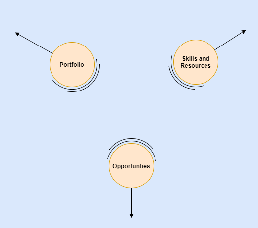
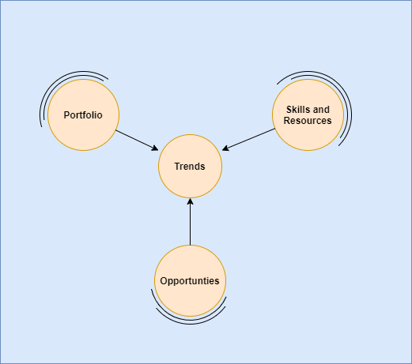

# Pulling the horizon closer

*October 2020*

Most of my presentations mention the need to "pull the horizon towards us"; here I am referring to the need for an organisation to look beyond their current demand signals and towards the things on the edge of demand; either the current edge of their portfolio or the overall edge of the market.

Today we see 3 main information baselines created to capture the demand signals an organisation uses to inform it's strategy (portfolio, employees, skills, partners, etc.)

### Project resources
Details of the active and soon to be started projects an organisation is delivering (circa. ~4 weeks before the project starts).  Too late to make any immediate changes, but the master source to understand the true nature of delivered projects and the skills and resources engaged.

`What We Sell vs. What We Deliver`

### In Progress Sales Opportunities with CRM systems
Depending on the time scale of the engagement, these could result in demands for project resource being made from everything ranging from 3 to 18 months; the real danger of the CRM system is the **confirmation bias** tracking your own portfolio can bring to an organisation; **"Has the market share changed?"**  or **"Has the market demand changed to something else?"**

### Hypothesis and Ideas
These are the one page idea documents or discussions during an innovation workshop or even at the watercooler; these could be 3 or more months away from developing into a formal sales opportunity, these can also completely disappear from your radar.  If viewed as a single discussion do not provide enough information to see the shift in the market and the changes required to an organisations portfolio. 

`What we sell vs. What we need`

## Listening to the signals

I think the challenges and risks to an organisation analysing just their CRM systems is clear; organisations must give sales and account teams simple mechanism to allow the hypothesis to be captured; captured in simple form and a central solution to allow the similarity of these signals to be analysed, both in terms of portfolio, the new enablers but also the associated market value.

### Connecting islands

 

If we continue to allow the horizon to move away from us, the risk is create even greater distance between our people, our portfolio, partners and the required skills to deliver increases.   Here organisations must plan to connect (tie ropes too) various anchor points within the conversion; each customer conversations should be analysed and the hypothesis should call out key trends and terms; skills and associated courses must be pulled closer to these same connection points.   

 

## Related work
Both my current focus projects **Digital Explorer** and **Employee Fingerprint** are two large islands throwing ropes to each other, let's see which organisations (my own?) dock and visit.

`digital explorer`, `digital fingerprint`

