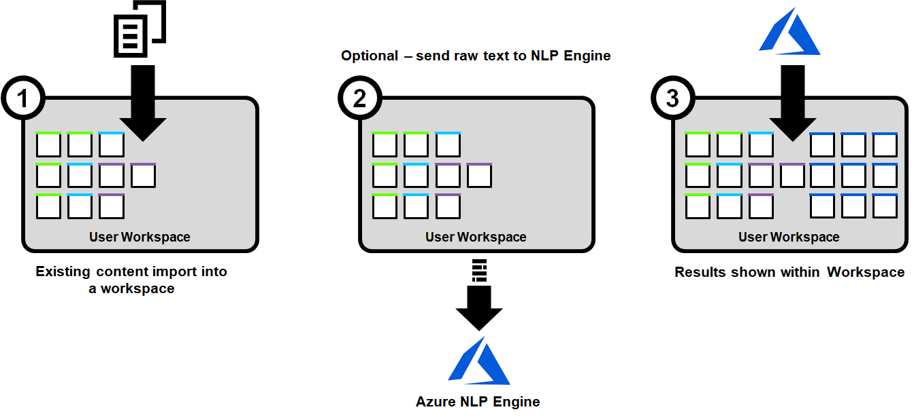
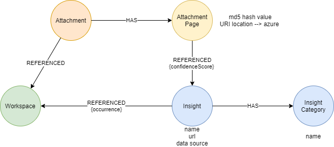
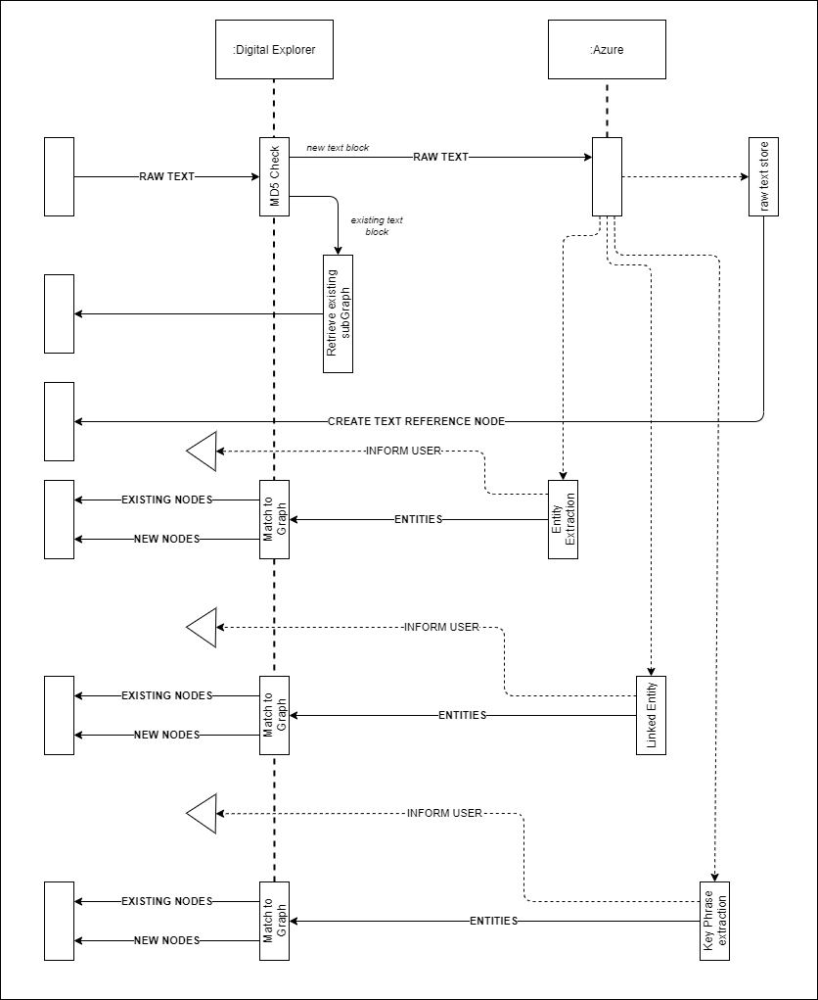

# NLP within Graph
## shifting from matching against what we know to what we don't (yet) know

To date the text analytics within the Digital Explorer platform has been based on matching against "things we already know", i.e. we analyse web sites and documents against our managed knowledge base of **Trends** and **Industry models** with some limited NLP applied.   
We are now mid-way through the development of an update to add full text analyse to our document reader.   Leveraging the Azure Cognitive Service API's we'll be passing the raw text to these API's.

 

From an individual user viewpoint this is going to bring some interesting new insights and we've been pushing UI designs around the team and userbase for a few weeks to see how to present these results back in a meaningful way; quite a challenge when some documents are returning 10,000+ new insights (see initial results below)

 

### Initial results

The main types of document our users analyse within Digital Explorer are investor and annual reports, so we took 2 as our reference points for this development effort.   The Azure Cognitive Services provide a number of options to analyse content against and we have chosen the [Named Entity Recognition (NER)](https://docs.microsoft.com/en-us/azure/cognitive-services/text-analytics/how-tos/text-analytics-how-to-entity-linking?tabs=version-3), Linked Entity (LER) and [Key Phrases](https://docs.microsoft.com/en-us/azure/cognitive-services/text-analytics/how-tos/text-analytics-how-to-keyword-extraction) services.

#### NER

||Healthcare Report|	Aerospace Report|
|---|---|---|
|Number of entities	|703|	1741|
|Execution time	|51 s.	|179 s.
|Number of requests|	42	|161
 

#### LINKED ENTITY RECOGNITION

||Healthcare Report|Aerospace Report |
|---|---|---|
|Number of entities	|71	|398|
|Execution time|18 s.|94 s.|
|Number of requests|42|161|
 

#### KEY PHRASES EXTRACTION

||Healthcare Report|Aerospace Report|
|---|---|---|
|Number of key phrases| 2972| 10842|
|Execution time|16 s.|88 s.|
|Number of requests|42|161|

One challenge to overcome was to break the raw text into chunks which we can pass to the API.  Azure places a limit of 5k character per transaction, so we needed to ensure we could control the API calls and deconstruct/reconstruct the text on both sides (shown above as the *Number of requests*).    This is working well and actually allows us to track and present progress back to users whilst some of the deeper analytics run in the background.

### The Graph Model

 

The Graph model is actually very simple, we have taken the decision to use a single node with 3 secondary labels to pull the 3 types of text matches together.  This gives us the advantage to enrich through each pass of the scan.   

- NER returns from initial matches
- LER returns new matches or enriches the information from the NER scan
- Key Phrases provide a further level of insight with category matching

`Insight:NERInsight|LEInsight|KPEInsight`

Allowing us to merge all the results into a single node, allowing both broad and focused queries into the Graph.

### Managing API costs
Each API call has an associated cost and performance/time impact to users.   As we split out each document to it's 5000 character chunks we generate an MD5 hash of the text string.   By storing this within the Graph we can quickly review and retrieve the results of documents if they have been scanned by another user; thus managing our calls and costs to the API.     This does present some potential issues in the future quality of the result set, so users will have the option (in a future release) to force a scan, update the MD5 value and refresh the stored result set. 

### The sequence diagram

Bringing this together can be shown in the following sequence diagram:

 

### The results in Graph
This is where it starts to get interesting, as mentioned above for an individual user or team reviewing a document it's going to bring value, but when we connect a collection of analysed documents together we can start to highlight patterns and key themes.

For example 
- key themes across a group of companies within a single industry
- key themes across a group of companies within a single industry and region

To highlight this within the UI, we have included an additional icon and filters within the insight overview to call out when an insight has a reference within another users workspace and the fact that we have stored this in a Graph allows us to leverage the relevant score based on the relationship weight within the overall knowledge graph.

 

_Thanks to Adrian Kasprzyk on the Digital Explorer development team for the coding and implementation of this._