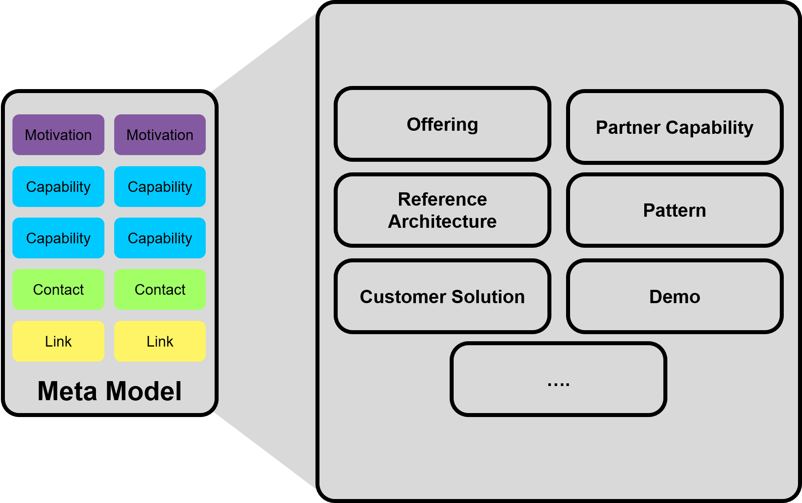
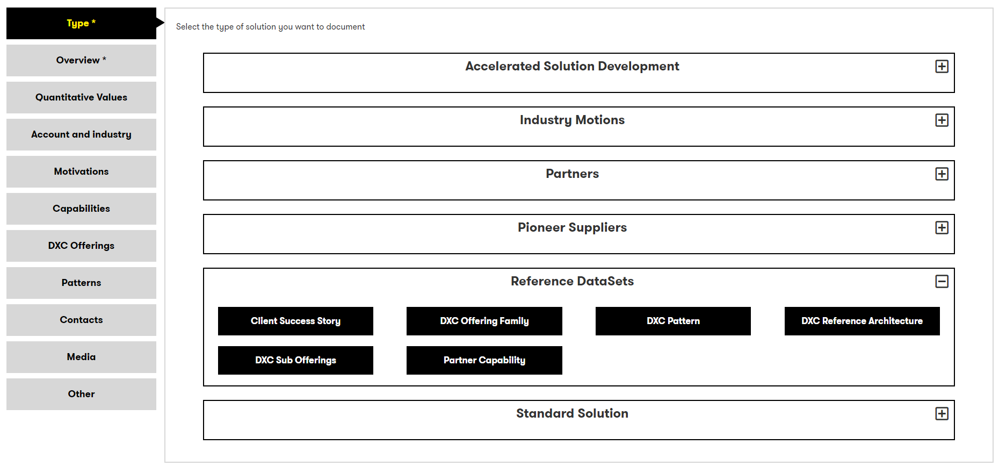
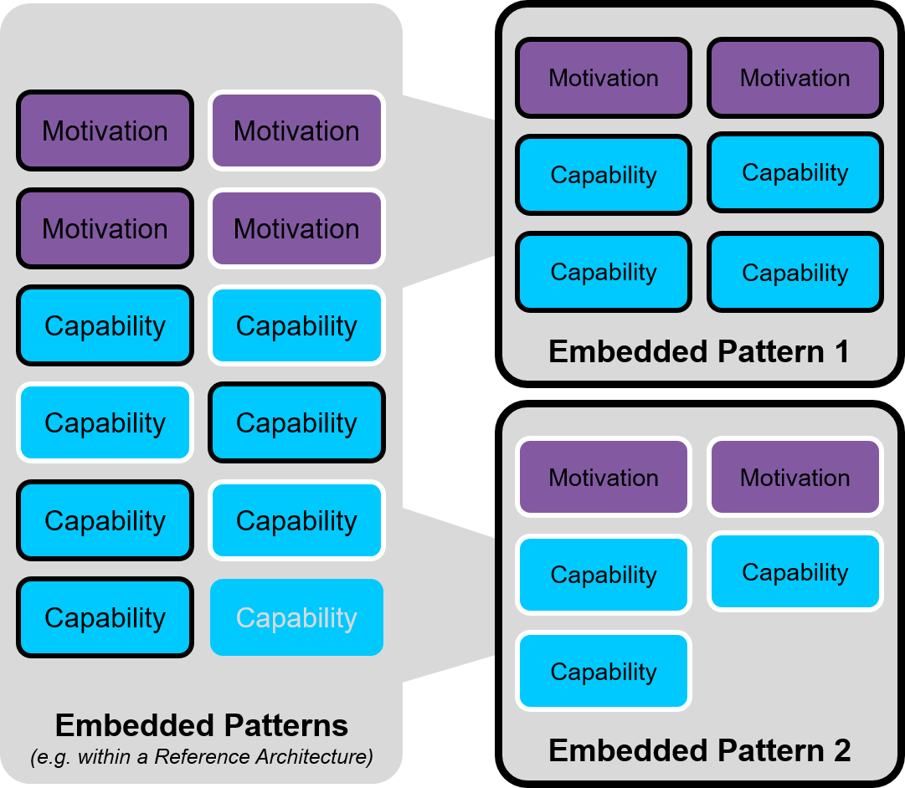
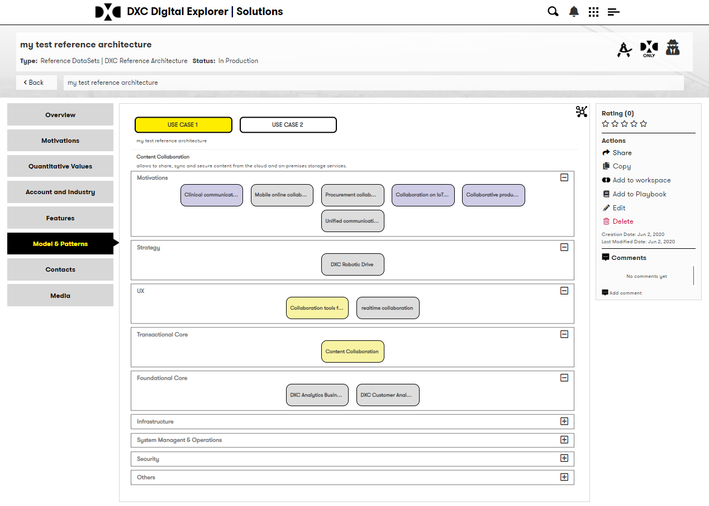
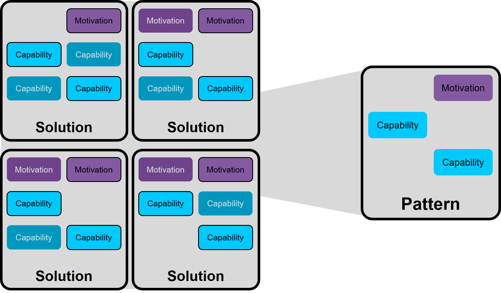
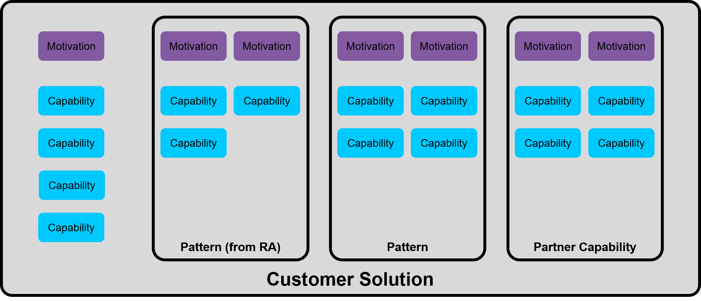
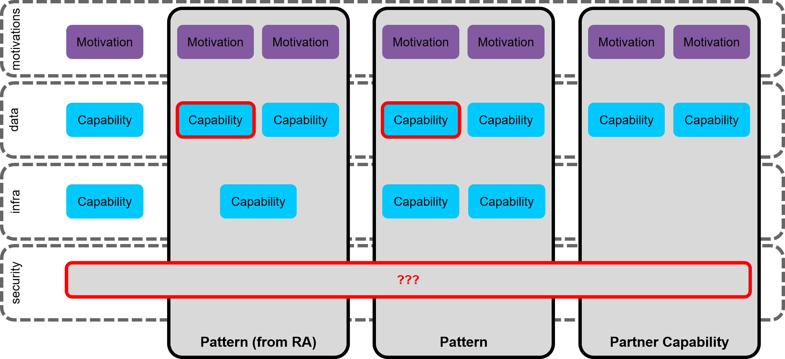
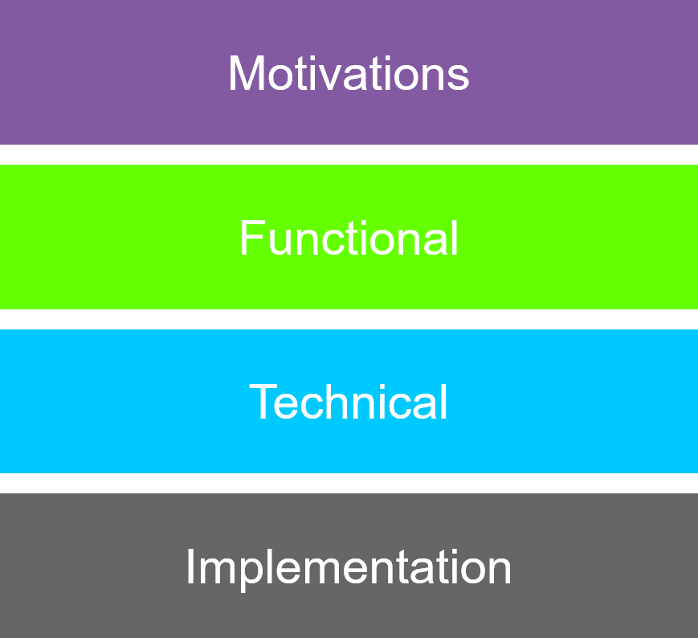

# Pattern Modelling
_June 2020_

The majority of my day job is in the role of product owner of [DXC Digital Explorer](https://digitalexplorer.dxc.com); one key module within this platform is the Solutions module; allowing teams to share, discover and reuse solutions DXC has delivered to it's customers.   At the core of this module is the [DXC technologies solution reference model](https://github.com/dxc-technology/dxc-digitalexplorer/blob/master/DataModels/SolutionMetaModel.md
).   

Within the construct of a data fuelled organisation the benefit to not only adopt a common information model to describe it's products or solutions provided to customers, but capture this information as a **true information data model** unlocks a number of use cases and brings increased value.

## Not all solutions are equal

The first benefit I am attempting to gain with a single information model for a "Solution" is the potential for any number of different types of solutions to be documented; these could range from internal offerings, partner capabilities, demonstration or concepts through to full scale production solutions delivered to a customer.

 

This is achieved by including a category (2 tier structure) against each solution model stored within Digital Explorer and is selected/managed on the very first pages when adding or editing a solution.

 
_View of the solution type selection within Digital Explorer ~ Note Pattern and Reference Architecture are within the "Reference Datasets" category_

## It's a model for a reason
Once a solution is captured as a data model the real potential to unlock new value becomes a reality and the means to leverage and reuse common patterns is possible.   **Documenting a pattern without the consumers understanding how it can be integrated into their own solution nullifies it's definition as a pattern; the information model used to describe the pattern must be known on both sides.**

## Standalone Patterns
It's possible to create a single solution model as a *Pattern* within Digital Explorer; leveraging the full information model and integrating the pattern into the wider information eco-system the platform enables.   A dedicated solution (sub)type for pattern is available today.
 

## Embedding Patterns
Digital Explorer also provides the ability to document 1 or more patterns within a single larger solution model (e.g. a Reference Architecture) 
 

 
_Example Pattern defined within DXC Digital Explorer_

## Future planned work

### Solutions become patterns
One of the true benefits of modelling all solutions, is the potential to use machine learning algorithms to help identify potential patterns from the complete or a subset of the solution information held. 

 

### Pattern becomes a standalone solution
Similar to the use case above, following the identification of a new pattern within a single solution, it may be beneficial to extract out the pattern into it's own dedicated solution model; allowing further information and it's own development lifecycle to be applied to the pattern, without impacting the original solution where the pattern was first described.

### Nesting Solutions ~ removing duplication and identifying risk

The ability to compose or layer in solutions models on top of each other allows complex solutions to be composed and validated during solution development. 
 
 
As patterns and other solutions types are added to a solution, duplications and gaps can be identified; Within Digital Explorer this is further simplified by aligning to key architectural domains or [technology groups]() within the solution model itself 

 

## Other benefits to consider

- Track changes and pattern alignment 
  - Allow pattern owners to gain a insight into the implementation view of their patterns (changes made, common components, industry and regional selections) 
  - Provide outside-in input to support further development and support within the organisation. 
- Allows for automation and improved workflows
  - Provides a known and trusted data stream into both manual processes and automated workflows.
- Provides integrable components
- The current information model only covers the first 2 layers of an architectural model; to bring true value and provide full automation (the architecture does become architecture-as-code), all 4 layers need to be included within a connected data model. 
 
- Cost modelling
  - Each capabilities and technical component included can also include a associated cost
  - The further down the model we are able to document the more accurate the cost 